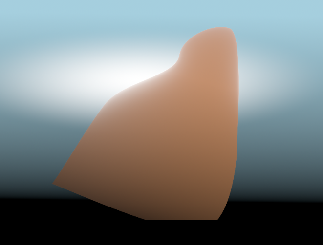
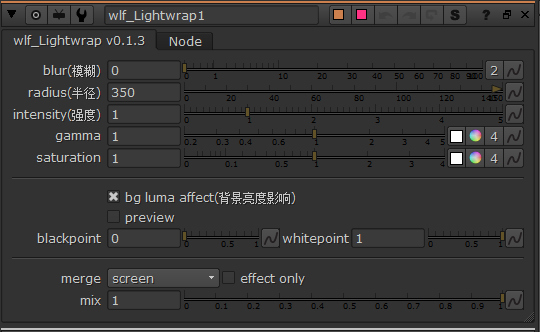

Draw
====
绘制,用于得到自定输出

Flicker
-------

灯光抖动生成器

.. image:: Flicker_node.png

控制
**********

.. image:: Flicker_panel.png

|wlf_Lightwrap_icon| wlf_Lightwrap
-------------------------------------------

.. image:: wlf_Lightwrap_node.png

修改过的灯光包裹,比自带的灯光包裹效果更好

  启用前

  启用后

控制
**********

.. |wlf_Lightwrap_icon| image:: wlf_Lightwrap_icon.png