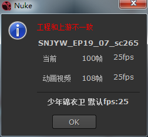
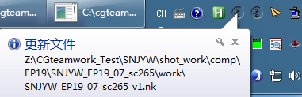
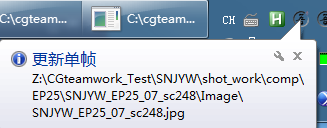
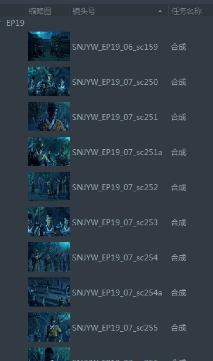

CGTeamWork集成
==========================

.. warning::

  这篇文档是写给老版本插件的, 新版使用 ``pyblish`` 进行集成, 文档待更新

此功能在无CGTeamWork安装时自动禁用

文件命名符合规范的文件会自动识别对应镜头

.. figure:: cgtw_onload.png

  打开文件时提示当前工程

上游检查
--------------

.. figure:: check_upstream_node.png

  打开文件时自动导入上游视频

  保存时如果工程设置和上游不一致将会警告

特效检查
-----------------

.. figure:: check_fx.png

  打开时如果有对应特效素材将会提示并自动打开对应文件夹

自动上传工作文件
---------------------

  保存时将会自动上传工程文件至服务器

.. figure:: auto_upload_nk_account_error.png

  只在当前用户负责制作此镜头时才会上传

自动生成并渲染单帧
------------------------

  保存并退出时 :ref:`wlf_Write` 节点会自动渲染单帧并上传至服务器供检查色板使用

.. figure:: auto_upload_jpg_account_error.png

  只在当前用户负责制作此镜头时才会上传

  还会同时在CGTeamWork上设置缩略图