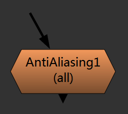

Filter
======

Aberration
----------

.. image:: Abberation_node.png

生成溢色效果

.. image:: Abberation_after.png
  :width: 200 px

控制
*************

.. image:: Abberation_panel.png

.. image:: Abberation_panel_2.png

AntiAliasing
------------

抗锯齿, 和模糊的区别是可以接受小数点级别的参数

控制
************

.. image:: AntiAliasing_panel.png

|HeatDistort_icon| HeatDistort
-----------------------------------------

.. image:: HeatDistort_node.png

用于快速制作热能置换效果

.. image:: HeatDistort_after.png

.. note::

  此节点带有动画效果

控制
*************

.. image:: HeatDistort_panel.png

|HighPassSharpen_icon| HighPassSharpen
----------------------------------------------

.. image:: HighPassSharpen_node.png

高通锐化

.. figure:: HighPassSharpen_hard.png

  hard 模式

.. figure:: HighPassSharpen_soft.png

  soft 模式

.. figure:: HighPassSharpen_only.png

  highpass only 模式

控制
*************

.. image:: HighPassSharpen_panel.png

|Mosaic_icon| mosaic
-------------------------

.. image:: mosaic_after.png

马赛克效果

Vignette
--------

.. image:: Vigenette_after.png

压暗角

wlf_MotionBlur
--------------

.. image:: wlf_MotionBlur_node.png

对Nuke自带MotionBlur节点的包装, 会英文直接用自带的就行

控制
**************

.. image:: wlf_MotionBlur_panel.png

.. |HighPassSharpen_icon| image:: HighPassSharpen_icon.png

.. |HeatDistort_icon| image:: HeatDistort_icon.png

.. |Mosaic_icon| image:: Mosaic_icon.png