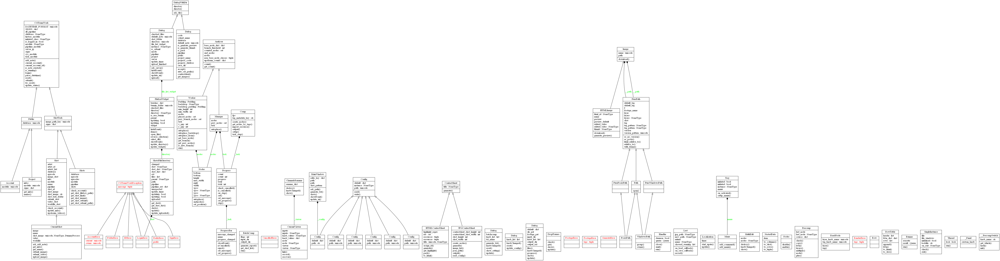

编程参考
========

UML包图

.. image:: references/packages.png
  :target: _images/packages.png

UML类图

.. tip::

  所有在 ``wlf`` 包中的API都是CGTeamWork和Nuke通用的

索引
----------

* :ref:`modindex`

* :ref:`名称索引 <genindex>`

.. toctree::
  :glob:
  :hidden:
  :caption: 模块

  references/*